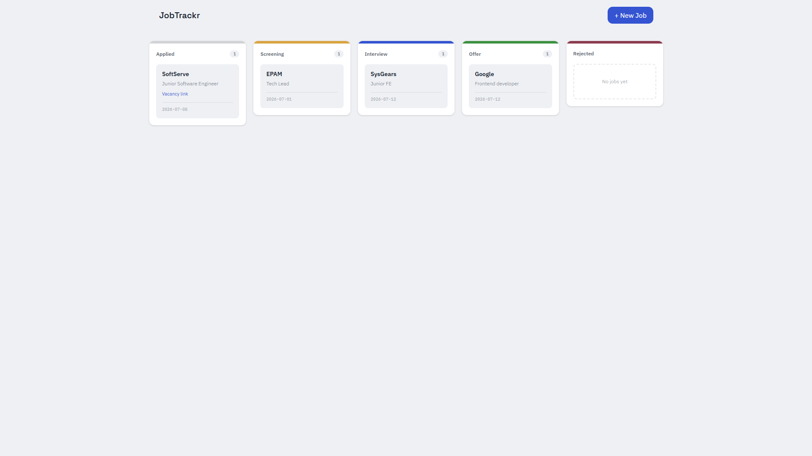

# JobTrackr

A kanban-style job application tracker for managing your job search — from application to offer.

[](https://github.com/Atsui04/jobtrackr/actions/workflows/ci.yml)



**[Live demo →](https://jobtrackr-nip0zc1v0-marks-projects-d14cc920.vercel.app/)**

## Features

- Kanban board with 5 statuses: Applied → Screening → Interview → Offer → Rejected
- Drag-and-drop between columns to update application status
- Full CRUD: add, edit, and delete job applications
- Optimistic UI updates with rollback on network errors
- Accessibility: full keyboard support, ARIA labels, native `<dialog>` focus trapping
- Component tests covering the form, card, and column
- CI pipeline: lint and tests run on every push/PR

## Tech stack

| Category     | Technology                               |
| ------------ | ---------------------------------------- |
| Frontend     | React, TypeScript, Vite                  |
| Styling      | Tailwind CSS v4                          |
| Backend / DB | Supabase (Postgres + auto-generated API) |
| Drag & Drop  | @dnd-kit/react                           |
| Testing      | Vitest, React Testing Library            |
| CI           | GitHub Actions                           |

## Running locally

```bash
git clone https://github.com/Atsui04/jobtrackr.git
cd jobtrackr
npm install
```

Create a `.env` file in the project root:

```
VITE_SUPABASE_URL=your-supabase-project-url
VITE_SUPABASE_ANON_KEY=your-supabase-anon-key
```

```bash
npm run dev
```

## Testing

```bash
npm run test
```

## Project structure

```
src/
  components/
    JobForm.tsx        # add/edit job modal
    JobCard.tsx         # a single job card on the board
    KanbanColumn.tsx     # a single status column
    KanbanBoard.tsx       # dnd context + grouping by status
  lib/
    supabase.ts          # Supabase client setup
    jobs.ts               # CRUD functions (getJobs, addJob, updateJob, deleteJob)
  types/
    job.ts                 # Job, NewJob, JobStatus types
    modalState.ts           # ModalState type
  utils/
    constants.ts            # status list and color tokens
```

## Database

A `jobs` table in Supabase with Row Level Security enabled. Schema:

| Column         | Type                |
| -------------- | ------------------- |
| `id`           | `uuid`, primary key |
| `company`      | `text`              |
| `position`     | `text`              |
| `status`       | `text`              |
| `applied_date` | `date`              |
| `link`         | `text`, nullable    |
| `notes`        | `text`, nullable    |
| `created_at`   | `timestamptz`       |
